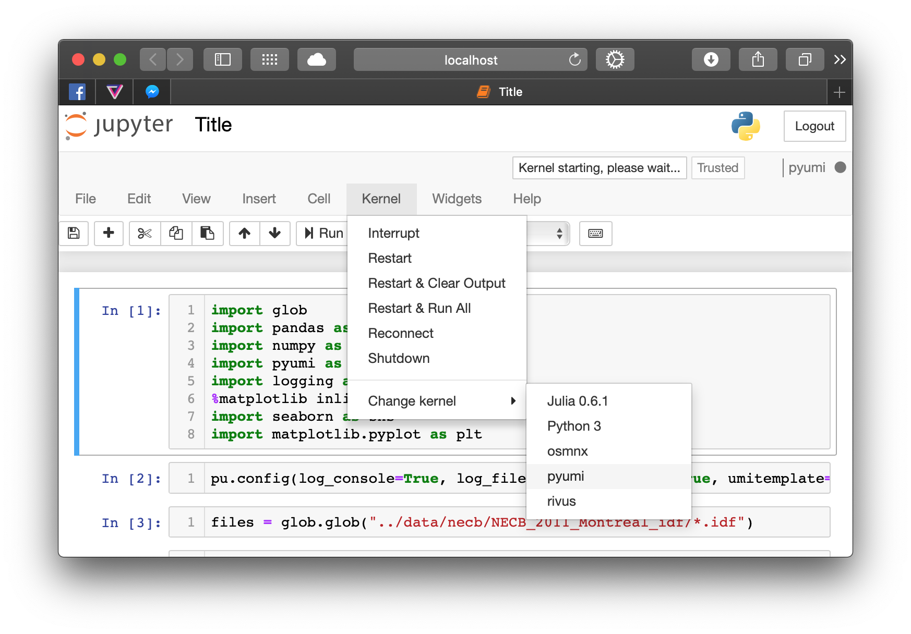

Installation
============

Requirements
------------

.. warning::

    Prior to installing this package, you must have EnergyPlus version 9.2.0 (download_ here at the bottom of
    the page).

`EnergyPlus`_ should be installed in it's default location. On Windows that would be in `C:\\EnergyPlusV9-2-0` and on
MacOS that would be in `/Applications/EnergyPlus-9-2-0`.

It is also recommended that the older transition programs be installed as well. These programs allow older IDF files
(versions 7.2 and below) to be upgraded to version 9-2-0. Since these, don't come by default with EnergyPlus, they
need to be installed by hand. A script has been created for windows (see `Installation from scratch`_). For
macOS, refer to the `supplementary conversion programs`_.

Installation from scratch
-------------------------

This first step should be helpful for users that are not familiar with python environments. If you already have python
installed and think that you can manage the installation a new package using `pip`, then you can skip to the next
section.

Download & Install MiniConda (or the full Anaconda)
...................................................

found at the following URL: https://docs.conda.io/en/latest/miniconda.html

Launch the executable and select the following settings:

- InstallationType=JustMe
- AddToPath=Yes (there might be a warning, but ignore it)
- RegisterPython=Yes
- Installation path=%UserProfile%\Miniconda3

Check if everything is ok by running `conda list` in the command line (make sure to open a new command line window just
in case). You should see something like this:

.. code-block:: doscon

    C:\Users\archetypal>conda list
    # packages in environment at C:\ProgramData\Miniconda3:
    #
    # Name                    Version                   Build  Channel
    asn1crypto                1.2.0                    py37_0
    ca-certificates           2019.10.16                    0
    certifi                   2019.9.11                py37_0
    ...
    win_inet_pton             1.1.0                    py37_0
    wincertstore              0.2                      py37_0
    yaml                      0.1.7                hc54c509_2

Install EnergyPlus & Conversion Programs
........................................

EnergyPlus is a prerequisite of archetypal. It must be installed beforehand. Moreover, archetypal contains routines that
may download IDF components that are coded in earlier versions of EnergyPlus (e.g., 7.1). For this reason, users should
also download the `supplementary conversion programs`_, and install the content in the EnergyPlus installation folder:

- On Windows: `C:\\EnergyPlusV9-2-0\\PreProcess\\IDFVersionUpdater` (For Windows, see automated procedure below).
- On MacOS: `/Applications/EnergyPlus-9-2-0/PreProcess/IDFVersionUpdater`

On Windows, this installation procedure can be automated with the following `script`_ which will download and installEnergyPlus as
well as the supplementary conversion programs.

To use the script, follow the next steps. First git must be installed beforehand with default installation parameters.
See https://git-scm.com/downloads to download git. Then the following commands will change the current directory to the
user's Downloads folder. Then the script will be downloaded using the `git clone` command. Finally the script will be executed.
Copy the whole code block below in Command Prompt and Hit :guilabel:`&Enter:⏎`.

.. code-block:: doscon

    cd %USERPROFILE%\Downloads
    git clone https://gist.github.com/aef233396167e0f961df3d62a193573e.git
    cd aef233396167e0f961df3d62a193573e
    install_eplus_script.cmd

To install *archetypal*, follow the steps detailed below in `Installing using pip`_

Installing using ``pip``
------------------------

If you have Python 3 already installed on your machine and don't bother to create a virtual environment (which is
highly recommended), then simply install using the following command in the terminal:

.. code-block:: shell

    pip install archetypal

.. hint::

    If you encounter an issue during the installation of archetypal using ``pip``, you can try
    out `Installing using conda (Anaconda)`_ instead.

Installation within a Virtual Environment
-----------------------------------------

It is highly recommended to use/install *archetypal* on a fresh python virtual environment. If you have any trouble
with the installation above, try installing archetypal in a new, clean `virtual environment`_ using venv or conda. Note
that this pacakge was tested with python 3.6:

.. code-block:: shell

    python3 -m venv archetypal
    source archetypal/bin/activate

Activating the virtual environment will change your shell’s prompt to show what virtual environment you’re using, and
modify the environment so that running python will get you that particular version and installation of Python. For
example:

.. code-block:: shell

    $ source archetypal/bin/activate
    (archetypal) $ python
    Python 3.5.1 (default, May  6 2016, 10:59:36)
    ...
    >>> import sys
    >>> sys.path
    ['', '/usr/local/lib/python35.zip', ...,
    '~/envs/archetypal/lib/python3.5/site-packages']
    >>>

Then you can install archetypal in this freshly created environment:

.. code-block:: shell

    pip install archetypal

To use the new environment inside a `jupyter notebook`_, we recommend using the steps described by `Angelo
Basile`_:

.. code-block:: shell

   source archetypal/bin/activate
   pip install ipykernel
   ipython kernel install --user --name=archetypal

Next time you `start a jupyter notebook`_, you will have the option to choose the *kernel* corresponding to your
project, *archetypal* in this case.

   choosing the correct kernel in a jupyter notebook.
   In the *kernel* menu, select *Change Kernel*
   and select the appropriate virtual env created earlier (*archetypal* in this case).

Installing using ``conda`` (Anaconda)
-------------------------------------

.. hint::

    If you encounter package dependency errors while installing `archetypal` using pip, you can use conda instead.

Installing with conda is similar to pip. The following workflow creates a new virtual environment (named archetypal)
which contains the required dependencies. It then installs the package using pip. You will need to download the
`environment.yml`_ file from the github repository. For the following code to work, first change the working
directory to the location of the downloaded `environment.yml` file. Here we use the `conda env update` method which
will work well to create a new environment using a specific dependency file in one line of code:

.. code-block:: shell

   conda update -n base conda
   conda env update -n archetypal -f environment.yml
   conda activate archetypal
   pip install archetypal

.. _start a jupyter notebook: https://jupyter.readthedocs.io/en/latest/running.html#starting-the-notebook-server
.. _jupyter notebook: https://jupyter-notebook.readthedocs.io/en/stable/#
.. _Angelo Basile: https://anbasile.github.io/programming/2017/06/25/jupyter-venv/
.. _virtual environment: https://docs.conda.io/projects/conda/en/latest/user-guide/tasks/manage-environments.html#managing-environments
.. _EnergyPlus: https://energyplus.net
.. _umi: https://umidocs.readthedocs.io/en/latest/
.. _download: https://github.com/NREL/EnergyPlus/releases/tag/v9.2.0
.. _supplementary conversion programs: http://energyplus.helpserve.com/Knowledgebase/List/Index/46/converting-older-version-files
.. _script: https://gist.github.com/samuelduchesne/aef233396167e0f961df3d62a193573e
.. _environment.yml: https://github.com/samuelduchesne/archetypal/blob/main/environment.yml