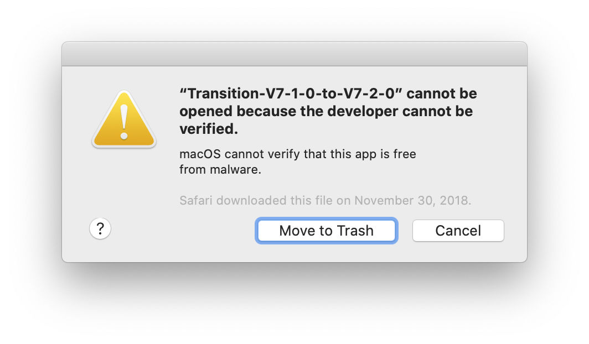
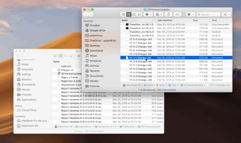

Troubleshooting
===============

MacOs Catalina Compatibility
----------------------------

With the release of MacOs Catalina, Apple requires apps to be signed and/or notarized. This helps users make sure they
open apps from trusted developers. It appears that the transition files that are needed to upgrade older IDF files to
the latest version of EnergyPlus are not signed. Thus, users using archetypal on the MacOs platform might encounter an
error of this type: "Transition cannot be opened because the developer cannot be verified". (see `Missing transition
programs`_ for more details on downloading and installing older transition programs).

It seems that clicking "cancel" will still work, although the prompt will appear for all older transition files
repetitively. An issue has been submitted `here <https://github.com/NREL/EnergyPlus/issues/7631>`_ on the EnergyPlus
github repository. Hopefully, the developers of EnergyPlus will be able to address this issue soon.

Missing transition programs
---------------------------

For older EnergyPlus file versions (< 7-1-0), the necessary transition files are not included with the EnergyPlus
installer. Users must download and install missing transition programs manually. This can be acheived in two simple
steps:

1. Navigate to the EnergyPlus Knowledgebase_ and download the appropriate transition programs depending on the platform
   you are using (MacOs, Linux or Windows). These programs come in the form of a zipped folder.
2. Extract all the files from the zipped folder to your EnergyPlus installation folder at
   ./PreProcess/IDFVersionUpdater/. For example, on MacOs with EnergyPlus version 8-9-0, this path is
   ``/Applications/EnergyPlus-8-9-0/PreProcess/IDFVersionUpdater/``.

.. _Knowledgebase: http://energyplus.helpserve.com/Knowledgebase/List/Index/46/converting-older-version-files